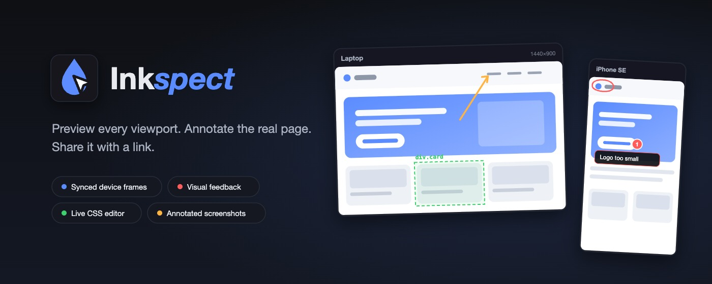
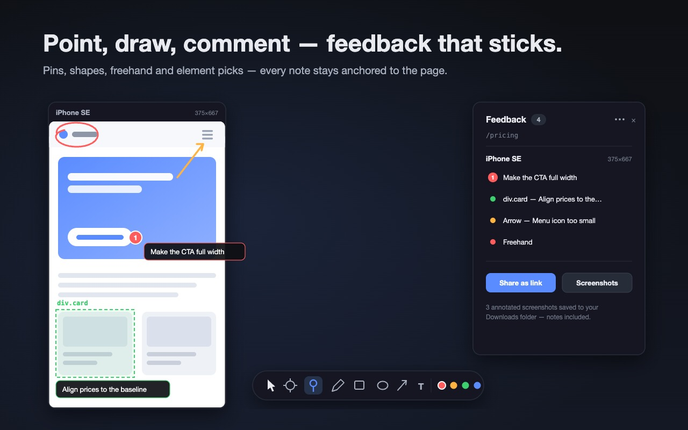
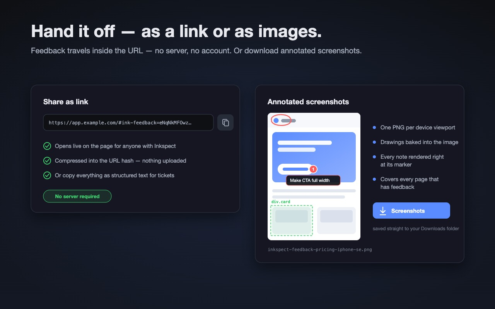

<p align="center">
  
</p>

<h1 align="center">Inkspect</h1>

<p align="center">
  <strong>Responsive preview & visual feedback — right on the running page.</strong><br />
  Browser extension for Chrome &amp; Firefox (Manifest V3). No external tools, no uploads, no account.
</p>

<p align="center">
  
</p>

## Features

### 📱 Synced device previews

The current page in multiple viewports side by side. Scrolling, clicks, inputs, hover (JS and CSS `:hover`, including Shadow DOM) and link navigation run on all frames simultaneously — each sync channel (scroll / hover / clicks & inputs) can be toggled individually from the toolbar. A URL watchdog realigns frames whose navigation drifts apart, including SPA routing via `pushState`.

- Row-filling grid: each row of device cards scales to the full grid width; reorder cards via drag & drop on their title bars
- Per-device **touch mode** (default for mobile viewports): dragging scrolls, hover is suppressed — toggle it from the card's title bar
- Custom viewport sizes, rotation and zoom; the whole setup persists across sessions


### ✏️ Feedback tools

Right-click any preview to open the tool palette: element picker (highlights DOM elements with a box-model overlay, a click captures them with a readable label), comment pins, freehand, rectangles, ellipses, arrows and text — every marking with an optional note (double-click a marker to edit it later). Markings stick to the content (document coordinates) and are bound to page + device — each marking lives only on the viewport it was drawn on.

- Keyboard: `1`–`7` picks a tool, `Esc` returns to interact mode, `Cmd/Ctrl+Z` undoes while drawing
- The feedback panel groups entries per page and per device; entries can be checked off (done markers render dimmed, badges count open items) and feedback from other domains is kept in its own collapsible section
- **Full window mode** shows the page at full size with a floating feedback bar — for giving feedback without the device grid



### 🔗 Share feedback — no server

All markings of a page are deflate-compressed and base64url-encoded into the URL hash (`#ink-feedback=…`). Recipients with the extension installed get the feedback imported and displayed automatically. Alternatively download annotated full-page screenshots of every page with open feedback (scroll-stitched, one image per device, drawings and notes rendered right at their markers).



### 🎨 Live CSS editor

Edit the page's stylesheets (including cross-origin via background fetch) in a CodeMirror editor; changes apply debounced across all frames, survive frame reloads and can be reset per sheet.


### 🛡️ Frame-blocking bypass

Pages with `X-Frame-Options`/`frame-ancestors` can still be embedded via opt-in (DNR session rule, only for the current tab and only for sub-frames).

## Privacy

Feedback is stored locally in your browser (`storage.local`). Nothing is uploaded anywhere — shared links carry the data inside the URL itself. See [PRIVACY.md](PRIVACY.md).

## Development

```sh
pnpm install
pnpm dev            # Chrome with live reload
pnpm dev:firefox
pnpm build          # production build to .output/
pnpm compile        # typecheck
pnpm icons          # render PNG icons from assets/icon.svg
pnpm store-assets   # render Chrome Web Store JPEGs from store/src/*.svg
pnpm test:e2e       # E2E suite (needs Google Chrome under /Applications)
```

Built with [WXT](https://wxt.dev), React 19 and CodeMirror 6. The E2E suite (`scripts/e2e-sync.mjs`) starts a local test server, installs the extension in real Chrome (headless, via CDP) and verifies sync, tools, the share round-trip, screenshot export and navigation.
