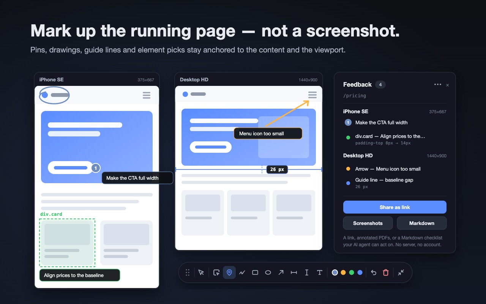
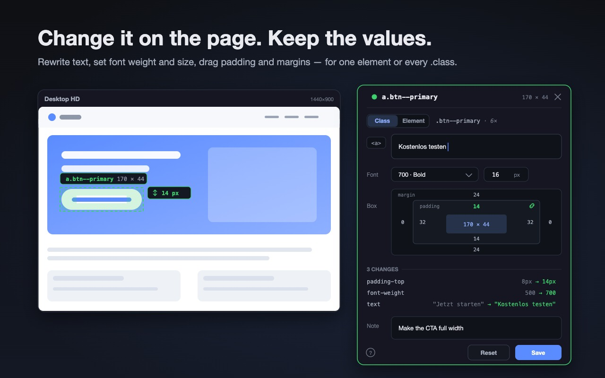
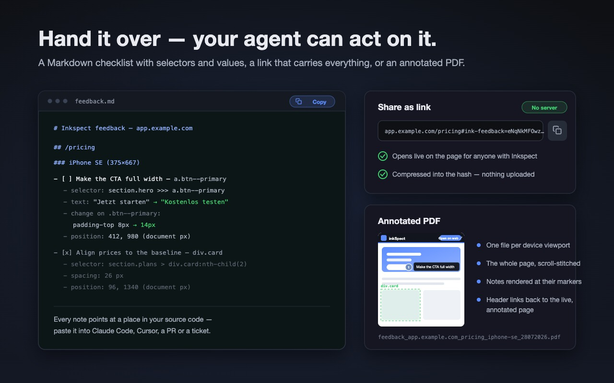
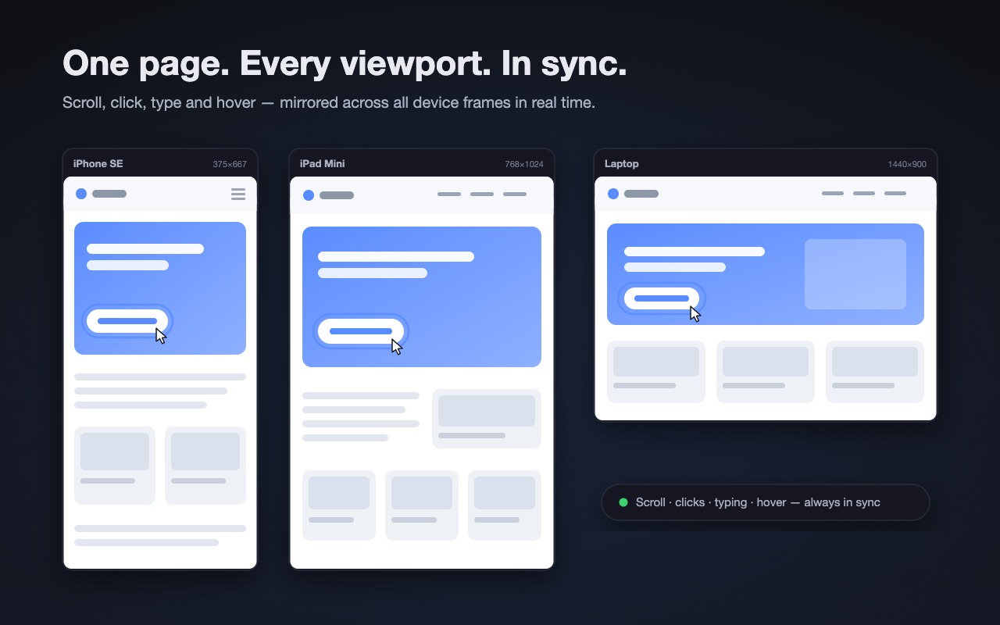
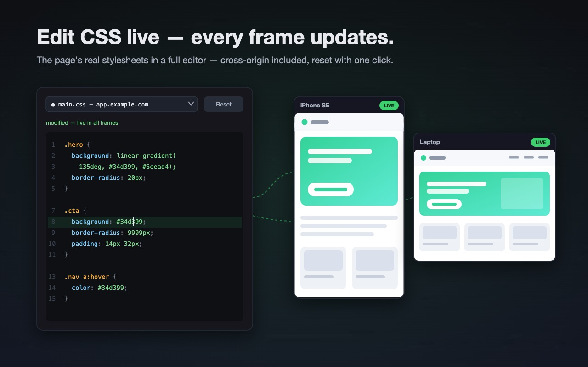

<p align="center">
  
</p>

<h1 align="center">Inkspect</h1>

<p align="center">
  <strong>Website feedback that AI understands.</strong><br />
  Browser extension for Chrome &amp; Firefox (Manifest V3). No external tools, no uploads, no account.
</p>

<p align="center">
  
</p>

## What it does

Mark up the page you are actually looking at — pin a comment, draw on it, pick an element, nudge its padding until it looks right — and hand the result over as something that can be acted on:

- a **Markdown checklist** with the CSS selector, the current value, the target value and the position of every note — paste it into Claude Code, Cursor or any agent
- a **share link** that carries the whole feedback set inside the URL, no server involved
- an **annotated PDF** per device viewport, with every note rendered at its marker

A screenshot plus "the button is too small" makes an agent guess. Inkspect writes down what you actually meant:

```markdown
## /pricing

### iPhone SE (375×667)
- [ ] Make the CTA full width — `a.btn--primary`
  - selector: `main > section.hero >>> a.btn--primary`
  - text: "Jetzt starten" → "Kostenlos testen"
  - change on `.btn--primary`: `padding-top` 8px → 14px
  - change on `.btn--primary`: `font-weight` 500 → 700
  - position: 412, 980 (document px)
- [x] Align prices to the baseline — `div.card`
  - selector: `section.plans > div.card:nth-of-type(2)`
  - spacing: 26 px
  - position: 96, 1340 (document px)
```

## Features

### ✏️ Feedback right on the running page

Right-click any preview to open the tool palette: element picker, comment pins, freehand, rectangles, ellipses, arrows, full-width/full-height guide lines and text — every marking with an optional note (double-click a marker to edit it later). Markings stick to the content (document coordinates, re-anchored to their DOM element on reload) and are bound to page + device — each marking lives only on the viewport it was drawn on.

- A guided tour runs on first open — it spotlights the card title bar, the right-click palette and the guide-line tools, and waits for you to actually perform the gesture. Restart it any time from the ⋯ menu; `?` opens the full shortcut sheet
- Keyboard: `1`–`9` picks a tool, `I` opens the font inspector, `Esc` returns to interact mode, `Cmd/Ctrl+Z` undoes while drawing
- Drag a marking of your own by its outline to reposition it; imported (shared) feedback stays where its author put it
- Two guide lines measure the gap between them in pixels — the number goes into the export
- The feedback panel groups entries per page and per device; entries can be checked off (done markers render dimmed, badges count open items) and feedback from other domains is kept in its own collapsible section
- Two or four marker colours, switchable in the ⋯ menu



### 🔍 Element picker with live edits

Pick an element and the inspector opens on it: rewrite its text, change font weight and size, drag its padding and margins per edge (or linked, all four at once). The change happens **on the page** — you see the result before you write it down — and is recorded as `from → to` on the marker.

- **Class or element scope**: edit `.btn--primary` and every one of them moves (the panel tells you how many elements the rule hits), or restrict the change to the one element you picked
- Boxes that are laid out by their container (`max-width`, `auto` margins) keep those values read-only instead of freezing a pixel value that breaks at other widths — padding still works
- Every edit is listed and revertable one by one; saved changes stay applied while their marker is visible



### 🤖 Hand it over — to an agent, a teammate or a ticket

- **Markdown** copies the whole domain as a checklist: note, selector, style and text changes, measured spacings, position, done state. The share payload is appended in a collapsible block, so the same text also restores the markings in the extension
- **Share link** deflate-compresses all markings of a page into the URL hash (`#ink-feedback=…`). Recipients with the extension installed get them imported and displayed automatically — nothing is uploaded anywhere
- **Annotated PDFs**, one per device viewport, of every page that has open feedback: the full page (scroll-stitched, not just the visible part), drawings baked in, notes rendered at their markers, and a header bar whose "Open on web" button is a live link back to the annotated page



### 📱 Synced device previews

The current page in multiple viewports side by side. Scrolling, clicks, inputs, hover (JS and CSS `:hover`, including Shadow DOM) and link navigation run on all frames simultaneously — each sync channel (scroll / hover / clicks & inputs) can be toggled individually from the toolbar. A URL watchdog realigns frames whose navigation drifts apart, including SPA routing via `pushState`.

- Row-filling grid: each row of device cards scales to the full grid width; reorder cards via drag & drop on their title bars
- Per-device **touch mode** (default for mobile viewports): dragging scrolls, hover is suppressed — toggle it from the card's title bar
- Custom viewport sizes, rotation and zoom; save a grid as a named set and bring it back later — the whole setup persists across sessions



### 🖥️ Full window mode

The page at full size with a floating feedback bar — drag it anywhere by its grip, it snaps to the left edge (vertical toolbox) or the bottom. A round feedback button opens the full-screen list; an optional floating phone mockup runs the same page in mobile width next to it. Inkspect can start in this mode by default (⋯ menu).

### 🎨 Live CSS editor

Edit the page's stylesheets (including cross-origin via background fetch) in a CodeMirror editor; changes apply debounced across all frames, survive frame reloads and can be reset per sheet.



### 🛡️ Frame-blocking bypass

Pages with `X-Frame-Options`/`frame-ancestors` can still be embedded via opt-in (DNR session rule, only for the current tab and only for sub-frames).

## Privacy

Feedback is stored locally in your browser (`storage.local`). Nothing is uploaded anywhere — shared links carry the data inside the URL itself. See [PRIVACY.md](PRIVACY.md).

## Development

```sh
pnpm install
pnpm dev            # Chrome with live reload
pnpm dev:firefox
pnpm build          # production build to .output/
pnpm compile        # typecheck
pnpm icons          # render PNG icons from assets/icon.svg
pnpm store-assets   # render Chrome Web Store JPEGs from store/src/*.svg
pnpm test:e2e       # E2E suite (needs Google Chrome under /Applications)
```

Built with [WXT](https://wxt.dev), React 19 and CodeMirror 6. The E2E suite (`scripts/e2e-sync.mjs`) starts a local test server, installs the extension in real Chrome (headless, via CDP) and verifies sync, tools, the share round-trip, screenshot export and navigation.

Planned work that is deliberately not built yet lives in [ROADMAP.md](ROADMAP.md).
